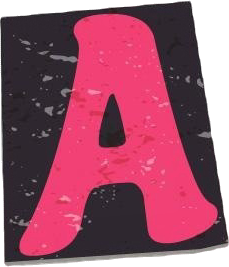
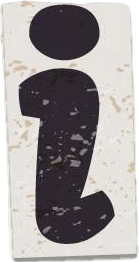

<!-- 

  

 -->

<!-- 

 -->

    <h1>Ruslan Belousov (@atrocityz)</h1>
    
    <h3></h3>

## <svg role="img" width="24" height="24" viewBox="0 0 24 24" xmlns="http://www.w3.org/2000/svg"><path d="M12.654 17.846c0 1.114.16 1.861.479 2.242.32.381.901.572 1.743.572.872 0 1.99-.44 3.356-1.319l.871 1.45C16.547 22.931 14.44 24 12.785 24c-1.656 0-2.964-.395-3.922-1.187-.959-.82-1.438-2.256-1.438-4.307V6.989H5.246l-.349-1.626 2.528-.791V2.418L12.654 0v4.835l5.142-.395-.48 2.857-4.662-.176v10.725Z"/></svg>ools & <svg role="img" width="24" height="24" viewBox="0 0 24 24" xmlns="http://www.w3.org/2000/svg"><path d="M4.23 0v24h15.541v-8.4004h-7.1719v3.5996H11.402V0z"/></svg>anguages

## <svg role="img" width="24" height="24" viewBox="0 0 24 24" xmlns="http://www.w3.org/2000/svg"><path d="M7.394 7.31a5.745 5.745 0 0 1-.833-.68c-.913-.91-1.38-2.067-1.38-3.568v-.575C6.699.929 9.039 0 11.828 0c5.394 0 8.515 2.8 9.285 6.74H16.22c-.54-1.554-1.89-2.764-4.352-2.764-2.422 0-4.136 1.276-4.473 3.334h-.002ZM4.683 3.062c0 3.236 2.034 5.162 6.106 6.177l4.316.983c3.854.87 6.2 3.03 6.2 6.55a6.61 6.61 0 0 1-1.436 4.239c0-3.511-1.85-5.409-6.31-6.55l-4.236-.946c-3.393-.76-6.011-2.536-6.011-6.36a6.578 6.578 0 0 1 1.37-4.093ZM17.18 16.484c-.292 2.235-2.092 3.495-4.698 3.495-2.314 0-4.048-.946-4.703-2.99H2.694C3.518 21.44 7.224 24 12.519 24c2.828 0 5.277-.87 6.85-2.439v-.55c0-1.66-.433-2.876-1.342-3.816a5.508 5.508 0 0 0-.847-.71v-.001Z"/></svg>tatistics

    

    
  

